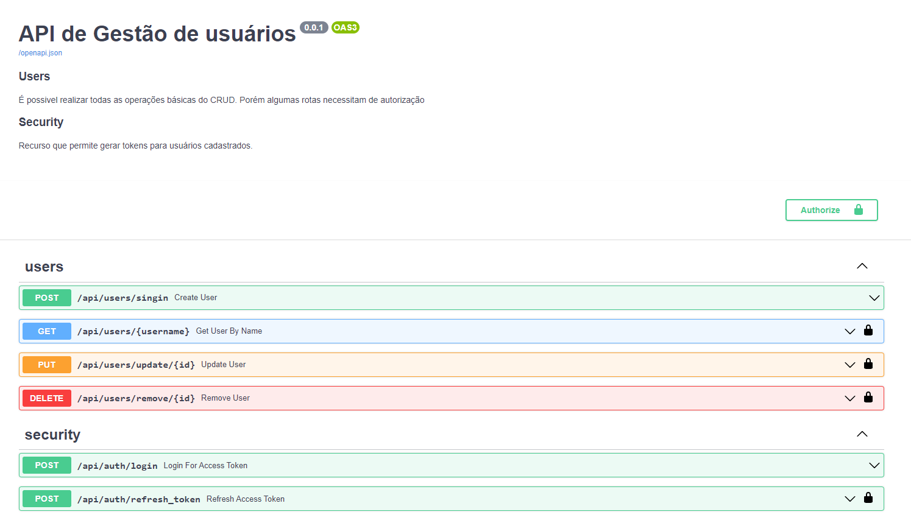

# FastAPI User API Com Login e Permissões

Este projeto é uma solução para o Desafio FastAPI proposto pela Paneas. O objetivo é construir uma aplicação RESTful utilizando o framework FastAPI, com ênfase em práticas de desenvolvimento, escalabilidade, segurança e integração com outras tecnologias.

Leia o [Desafio FastAPI - Paneas](./docs/desafio_fastAPI_Paneas.md) para obter mais detalhes.

## Nivéis Implementados

1. **API de Gerenciamento de Usuários**
   - ✅ CRUD User
   - ✅ Autenticação baseada em tokens (JWT) 
   - ✅ Permissões de Usuário (admin, usuário regular)

2. **Integração com Banco de Dados**
   - ✅ SQLAlchemy como ORM
   - ✅ Integração com PostgreSQL
   - ✅ Migrações de Banco de Dados com Alembic

3. **Documentação da API**
   - ✅ Utilização do Swagger
   - ✅ Documentação de Endpoints e Modelos
   - ✅ Exemplos de Requisições e Respostas

4. **Dockerização da Aplicação**
   - ✅ Dockerfile fornecido
   - ✅ docker-compose fornecido
   - ✅ Orquestração eficiente da aplicação e banco de dados

---

## Entrega

O código-fonte está disponível neste [repositório Git](https://github.com/tiagoGIM/fast-api-challenge-user). Siga as instruções abaixo para configurar e executar a aplicação.

Uma documentação detalhada e justificativa de abordagens de desenvolvimento estão disponíveis em um [passo a passo](./docs/step-by-step.md) que usei para registrar o desenvolvimento.

## Pré-requisitos 

Antes de iniciar a execução do projeto, certifique-se de ter as seguintes ferramentas instaladas:

- **Docker:** O projeto utiliza Docker para facilitar a execução em diferentes máquinas e também por ser um dos critérios do desafio.
    -- [Site Oficial para instalar o Docker](https://docs.docker.com/engine/install/)

### Configuração e Execução

1. Clone o repositório:
```bash
  git clone https://github.com/tiagoGIM/fast-api-challenge-user
 ```


2. Navegue até o diretório do projeto:

```bash
  cd fast-api-challenge-user
```

3. Execute o Docker Compose:

```bash
  docker-compose up --build

```

4. Execute as migrations
acesse o terminal docker da api e rode o seguinte comando
```bash
  alembic upgrade head
```


O Docker Compose criará os contêineres necessários para a aplicação e o banco de dados PostgreSQL. Após a conclusão, a aplicação estará acessível em http://localhost:8000 e a documentação da API em http://localhost:8000/docs.


## Endpoints

O projeto incorpora uma estrutura de segurança, possui rotas protegidas e usuários com distintas permissões. Nesse contexto, foram implementadas rotas públicas, acessíveis a usuários comuns, bem como rotas de nível restrito para administradores. Essa abordagem visa garantir um controle efetivo de acesso e segurança na aplicação, atendendo às necessidades específicas de cada tipo de usuário.




## Authors

- [@tiagoGIM](https://www.github.com/tiagoGIM)


## 🔗 Links

[](https://www.linkedin.com/in/tiaho-hs-almeida)


## License

[MIT](https://choosealicense.com/licenses/mit/)

